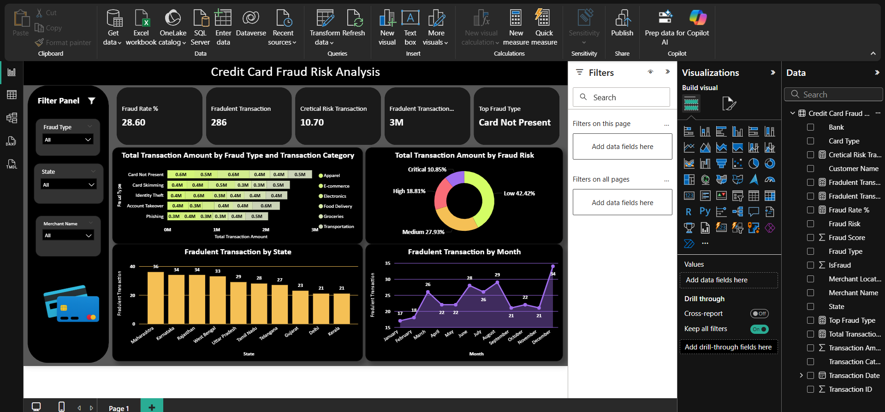

# 💳 Credit Card Fraud Risk Analysis – Power BI


---

## 📌 Table of Contents
- [👋 Introduction](#-introduction)
- [🎯 Objective](#-objective)
- [🛠 Skills & Tools](#-skills--tools)
- [📂 Dataset Overview](#-dataset-overview)
- [🔍 Key Insights](#-key-insights)
- [📊 Dashboard Highlights](#-dashboard-highlights)
- [🚀 Recommendations](#-recommendations)
- [📂 Project Structure](#-project-structure)
- [💭 What I Learned](#-what-i-learned)
- [⭐ Final Note](#-final-note)

---

## 👋 Introduction
Credit card fraud is one of the **biggest challenges in banking and finance** — costing billions every year and constantly evolving with new techniques.  
This **Power BI project** analyzes credit card transactions to uncover fraud patterns, assess risk levels, and provide **interactive dashboards** that empower real-time decision-making.

I designed this dashboard to go beyond static charts — it tells a **story with the data**, helping stakeholders spot risky transactions before they become losses.

---

## 🎯 Objective
- Detect and visualize **fraud trends** across regions, time, and transaction types.
- Assess **risk levels** and highlight critical fraud cases.
- Enable **interactive filtering** for deep dives into specific fraud categories or geographies.
- Provide **business-ready recommendations** to reduce fraud.

---

## 🛠 Skills & Tools
| **Skill**                  | **Tools Used** |
|----------------------------|----------------|
| Data Visualization         | Power BI |
| Data Transformation        | Power Query |
| Business Intelligence      | Interactive Dashboards, Drill-Through Filters |
| Data Analysis              | Risk Segmentation, Fraud Pattern Recognition |

---

## 📂 Dataset Overview
**File:** `Credit Card Fraud Risk Analysis.csv`  
Contains:
- **Fraud Type** – Card Not Present, Skimming, Identity Theft, etc.
- **Transaction Category** – Apparel, E-commerce, Groceries, etc.
- **Geography** – State-wise fraud counts.
- **Transaction Date** – Monthly fraud trends.
- **Risk Level** – Low, Medium, High, Critical.

---

## 🔍 Key Insights
### 📅 Fraud Type & Category
- **Top fraud type:** Card Not Present  
- Significant fraud in **E-commerce** and **Apparel** categories.

### 🌍 Geographic Risk
- **Highest fraud states:** Maharashtra (36), Karnataka (34), Rajasthan (34).  
- Certain states consistently show **above-average risk**.

### ⏳ Time Trends
- Fraud spikes in **December** (34 cases) and **July** (28 cases).  
- Lower fraud activity during **February** and **April**.

### 🎯 Risk Levels
- **Low risk:** 42.42% of transactions.  
- **Critical risk:** 10.85% — small share but **high business impact**.

---

## 📊 Dashboard Highlights


**Features:**
- 📍 **Filter panel** for Fraud Type, State, Merchant Name.  
- 📊 Risk breakdown by category and geography.  
- 📈 Monthly fraud trendline.  
- 🏷 Transaction counts and fraud rates displayed prominently.

---

## 🚀 Recommendations
1. **Enhanced Monitoring** – Real-time alerts for critical-risk transactions.
2. **Geographic Targeting** – Focus fraud prevention in Maharashtra, Karnataka, Rajasthan.
3. **Seasonal Preparedness** – Increase fraud detection efforts in July & December.
4. **Merchant Screening** – Stricter verification for high-risk merchant categories.

---

## 📂 Project Structure
```
├── Credit Card Fraud Risk Analysis by Kasif.pbix  # Power BI dashboard file
├── Credit Card Fraud Risk Analysis.csv            # Dataset
├── Credit Card Fraud Risk Analysis.pdf            # PDF summary
├── assets/
│   ├── fraud_dashboard_cropped.png                # Dashboard screenshot (cropped)
├── README.md                                      # Project documentation
```

---

## 💭 What I Learned
- Designing BI dashboards is as much about **storytelling** as it is about numbers.
- Even a small percentage of **critical-risk** transactions can cause **significant losses**.
- Interactivity (filters, slicers) is key to **executive decision-making**.

---

## ⭐ Final Note
If you found this project insightful, ⭐ the repository and connect with me on [LinkedIn](https://www.linkedin.com/).  
I’m open to discussions, feedback, and collaborations in analytics & BI.

---
